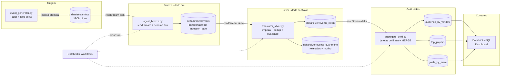

# sports-realtime-pipeline-databricks

Pipeline de dados **em tempo real** para eventos de transmissoes esportivas
(futebol), construido com **PySpark Structured Streaming**, **Delta Lake** e
**arquitetura Medallion** (Bronze / Silver / Gold) sobre o Databricks.

O pipeline ingere eventos de partida — gols, cartoes, substituicoes,
finalizacoes e audiencia — e entrega KPIs atualizados a cada poucos segundos
em tabelas Delta consultaveis pelo Databricks SQL.

[](https://github.com/kayegomes/sports-realtime-pipeline-databricks/actions/workflows/ci.yml)

---

## Sumario

- [Dados simulados, sem dependencia externa](#dados-simulados-sem-dependencia-externa)
- [Arquitetura](#arquitetura)
- [O que cada camada faz](#o-que-cada-camada-faz)
- [Decisoes tecnicas](#decisoes-tecnicas)
- [Tecnologias](#tecnologias)
- [Estrutura do projeto](#estrutura-do-projeto)
- [Rodando localmente](#rodando-localmente)
- [Rodando no Databricks](#rodando-no-databricks)
- [Testes](#testes)
- [CI/CD](#cicd)
- [Proximos passos](#proximos-passos)

---

## Dados simulados, sem dependencia externa

**Este projeto nao consome nenhuma API de terceiros.** Os eventos sao
gerados pelo proprio repositorio (`src/generator/event_generator.py`), que
usa o Faker para produzir nomes de jogadores e escreve arquivos JSON Lines
em uma pasta monitorada — o papel que um topico Kafka teria em producao.

Consequencias praticas:

- **Nao ha chave de API, token ou credencial** para configurar. Clonou,
  instalou as dependencias, rodou.
- **Nao ha limite de requisicao nem cota** para estourar, e o pipeline nao
  quebra porque um servico de terceiros saiu do ar.
- **Os testes e o CI sao deterministicos**: o gerador aceita `--seed`, entao
  a mesma semente produz a mesma sequencia de partidas e eventos.
- **O volume e o comportamento sao controlaveis**: `--matches`,
  `--events-per-tick` e `--dirty-rate` ajustam carga e qualidade do dado de
  entrada, o que seria impossivel com uma fonte real.

A unica atividade de rede do projeto acontece na primeira execucao local,
quando o `delta-spark` baixa o jar do Delta Lake do Maven Central — depois
disso ele fica em cache e tudo roda offline. No Databricks, nem isso: o
Delta ja vem no runtime.

Trocar por uma fonte real e um ajuste localizado: apenas `read_raw_stream`
em `src/bronze/ingest_bronze.py` muda de `.format("json")` para
`.format("kafka")`. Silver e Gold nao sabem de onde o dado veio.

---

## Arquitetura



Cada camada mantem seu **proprio checkpoint**, o que permite reprocessar uma
delas sem tocar nas outras:

```
delta/checkpoints/
├── bronze/
├── silver/
└── gold/
    ├── audience/
    ├── players/
    └── team_goals/
```

---

## O que cada camada faz

### Bronze — fidelidade a origem

| | |
|---|---|
| Entrada | `data/streaming/*.json` |
| Saida | `delta/bronze/events` |
| Modo | `append`, particionado por `ingestion_date` |

- Le com **schema explicito** (inferencia de schema fica desligada em
  streaming: um arquivo atipico nao pode mudar o contrato da tabela no meio
  da execucao).
- Nao aplica nenhuma regra de negocio — inclusive o dado ruim entra.
- Adiciona `ingestion_timestamp`, `ingestion_date` e `source_file`
  (via a coluna oculta `_metadata`), garantindo rastreabilidade.

### Silver — dado confiavel

| | |
|---|---|
| Entrada | `delta/bronze/events` |
| Saida | `delta/silver/events_clean` + `delta/silver/events_quarantine` |
| Modo | `foreachBatch` (duas saidas, uma unica leitura da Bronze) |

1. `timestamp` (string ISO) vira `event_timestamp` — a coluna de *event time*
   usada pelas janelas da Gold.
2. Padronizacao de texto sem UDF: acentos removidos com `translate`, espacos
   colapsados com `regexp_replace`, nomes de time resolvidos por um
   `map` literal (`Fla` → `Flamengo`, `Timao` → `Corinthians`, ...).
3. Deduplicacao por `event_id` dentro do watermark — o gerador reenvia
   eventos de proposito, simulando a entrega *at-least-once* de um broker.
4. **Oito regras de qualidade**. Quem passa vai para `events_clean`; quem
   falha vai para `events_quarantine` **com o motivo** na coluna
   `quality_errors`. Nada e descartado silenciosamente.

| Regra | O que valida |
|---|---|
| `event_id_presente` | identificador nao nulo |
| `timestamp_valido` | data/hora ISO parseavel |
| `minuto_valido` | `0 <= minute <= 90` |
| `tipo_evento_conhecido` | `gol`, `cartao`, `substituicao`, `finalizacao` |
| `audiencia_nao_negativa` | `audience_count >= 0` |
| `audiencia_plausivel` | audiencia abaixo do teto de telemetria |
| `jogador_informado` | `player_name` nao nulo |
| `time_informado` | `team` nao nulo |

### Gold — KPIs em tempo real

| | |
|---|---|
| Entrada | `delta/silver/events_clean` |
| Saida | `delta/gold/kpis_realtime/{audience_by_window, top_players, goals_by_team}` |
| Modo | `update` + `foreachBatch` + `MERGE` |

| Tabela | KPI |
|---|---|
| `audience_by_window` | audiencia media, pico e minimo por partida, gols e total de eventos na janela |
| `top_players` | top 3 jogadores por numero de eventos, com gols, cartoes e finalizacoes |
| `goals_by_team` | gols, cartoes, substituicoes e finalizacoes por time |

---

## Decisoes tecnicas

**Por que `foreachBatch` + `MERGE` na Gold, e nao `append`?**
Uma agregacao com janela em modo `append` so emite a linha quando a janela
fecha, ou seja, apos o watermark — o painel ficaria minutos atrasado. Em modo
`update` o Spark reemite a janela a cada micro-batch e o `MERGE` sobrescreve
a versao anterior dela. Resultado: a tabela Delta reflete o estado atual e o
dashboard nao precisa esperar.

**Por que o top N e recalculado a partir de uma tabela de apoio?**
O micro-batch contem apenas os jogadores que tiveram eventos *agora*. Rankear
so o batch tiraria do top 3 quem lidera mas ficou parado no intervalo. Por
isso o fluxo tem dois passos: o batch e mesclado em `player_events` e o
ranking e recalculado lendo essa tabela, restrita as janelas tocadas pelo
batch com um `left_semi` join — sem `collect()` no driver.

**Por que regras de qualidade em PySpark puro, e nao Great Expectations?**
Great Expectations e PyDeequ trabalham em modo batch e exigem uma acao de
coleta, o que quebra uma query de micro-batch. As regras aqui sao `Column`
do Spark: avaliadas de forma distribuida, funcionam em streaming e sao
testaveis com DataFrames estaticos. O `requirements.txt` deixa as duas
bibliotecas comentadas para quem quiser gerar relatorios em batch.

**Por que escrita atomica no gerador?**
O gerador escreve em `_tmp_<nome>.json` e so entao renomeia. O Spark ignora
arquivos iniciados por `_`, e o rename no mesmo diretorio e atomico — assim a
Bronze nunca le um arquivo pela metade.

**Por que `txnAppId` + `txnVersion` na Silver?**
`foreachBatch` oferece garantia apenas *at-least-once*: se o batch falhar
apos a escrita, ele e reprocessado e as linhas seriam duplicadas. Com essas
duas opcoes, o Delta reconhece a transacao ja aplicada e a ignora, tornando a
escrita idempotente.

**Por que todas as transformacoes sao funcoes puras?**
`transform_silver`, `audience_kpis`, `rank_top_players` e companhia recebem e
devolvem `DataFrame`, sem tocar em I/O. O watermark so e aplicado quando
`df.isStreaming` e verdadeiro. Isso significa que **a mesma funcao** roda em
streaming, em batch (para backfill) e nos testes — sem duplicar logica e sem
precisar subir uma query para testar uma regra.

---

## Tecnologias

| Tecnologia | Uso |
|---|---|
| PySpark 3.5 (Structured Streaming) | processamento distribuido e streaming |
| Delta Lake 3.1 | tabelas ACID, `MERGE`, time travel |
| Databricks Runtime 14.3 LTS | ambiente de execucao |
| Databricks Workflows | orquestracao das tres camadas |
| Faker | nomes de jogadores realistas |
| pytest + chispa | testes unitarios de DataFrames |
| ruff | lint e formatacao |
| GitHub Actions | CI (lint, testes e smoke test ponta a ponta) |

> **Compatibilidade:** as versoes fixadas no `requirements.txt` espelham o
> DBR 14.3 LTS (Spark 3.5.0 + Delta 3.1). Para o **DBR 13.3 LTS**, use
> `pyspark==3.4.1` e `delta-spark==2.4.0` — o codigo nao precisa de ajuste.

---

## Estrutura do projeto

```
sports-realtime-pipeline-databricks/
├── README.md
├── requirements.txt
├── pyproject.toml              # config do pytest, ruff e coverage
├── .gitignore
├── src/
│   ├── config.py               # caminhos e regras de negocio (sem dependencia de Spark)
│   ├── generator/
│   │   └── event_generator.py  # simulador de eventos (o "Kafka" do projeto)
│   ├── bronze/
│   │   └── ingest_bronze.py
│   ├── silver/
│   │   └── transform_silver.py
│   ├── gold/
│   │   └── aggregate_gold.py
│   └── utils/
│       ├── spark_session.py    # SparkSession local ou Databricks
│       └── quality_checks.py   # framework de expectativas em PySpark puro
├── notebooks/                  # versoes Databricks das tres camadas
│   ├── 01_bronze_ingestion.py
│   ├── 02_silver_transformation.py
│   └── 03_gold_aggregation.py
├── scripts/
│   └── validate_pipeline.py    # validacao ponta a ponta (usada pelo CI)
├── tests/
│   ├── conftest.py
│   ├── test_bronze.py
│   ├── test_silver.py
│   └── test_gold.py
└── .github/workflows/ci.yml
```

---

## Rodando localmente

### Pre-requisitos

- **Python 3.10+**
- **Java 11** (ou 17) — o PySpark roda na JVM. Verifique com `java -version`.
- No **Windows**, o Hadoop precisa do `winutils.exe`: baixe-o, coloque em
  `C:\hadoop\bin` e defina `HADOOP_HOME=C:\hadoop`. Sem isso o Spark falha ao
  escrever arquivos locais.

### Instalacao

```bash
git clone https://github.com/kayegomes/sports-realtime-pipeline-databricks.git
cd sports-realtime-pipeline-databricks

python -m venv .venv
source .venv/bin/activate        # Windows: .venv\Scripts\activate

pip install -r requirements.txt
```

### Execucao em modo streaming (4 terminais)

```bash
# Terminal 1 - gera eventos a cada 5 segundos (Ctrl+C para parar)
python -m src.generator.event_generator

# Terminal 2 - Bronze
python -m src.bronze.ingest_bronze

# Terminal 3 - Silver
python -m src.silver.transform_silver

# Terminal 4 - Gold
python -m src.gold.aggregate_gold
```

### Execucao em lote (um terminal)

Cada camada aceita `--once`, que usa o trigger `availableNow`: processa todo
o backlog disponivel e encerra. E o mesmo codigo do modo continuo.

```bash
python -m src.generator.event_generator --max-ticks 10 --interval 0 --seed 42
python -m src.bronze.ingest_bronze --once
python -m src.silver.transform_silver --once
python -m src.gold.aggregate_gold --once

# Confere o resultado das tres camadas
python scripts/validate_pipeline.py
```

O `validate_pipeline.py` le apenas as tabelas Delta em disco (nenhuma chamada
externa) e comeca imprimindo a contagem de registros de cada camada, o que
mostra de imediato onde o dado parou de fluir:

```
==========================================
REGISTROS POR CAMADA
==========================================
  Origem (JSON)                       120
  Bronze / events                     120
  Silver / events_clean               101
  Silver / events_quarantine           11
  Gold / audience_by_window             2
  Gold / player_events                 34
  Gold / top_players                    6
  Gold / goals_by_team                  4
==========================================
```

### Opcoes do gerador

| Flag | Padrao | Descricao |
|---|---|---|
| `--interval` | `5` | segundos entre ciclos |
| `--matches` | `3` | partidas simuladas em paralelo |
| `--events-per-tick` | `2` | eventos por partida em cada ciclo |
| `--dirty-rate` | `0.08` | fracao de eventos com defeito proposital |
| `--max-ticks` | infinito | encerra apos N ciclos |
| `--seed` | aleatorio | geracao deterministica |
| `--output` | `data/streaming` | pasta de saida |

> O `--dirty-rate` existe de proposito: sem dado ruim na origem, as regras de
> qualidade da Silver seriam apenas decorativas. Cada defeito injetado tem uma
> regra correspondente.

### Variaveis de ambiente

| Variavel | Padrao local | Descricao |
|---|---|---|
| `SPORTS_DATA_ROOT` | `./data` | raiz dos arquivos de origem |
| `SPORTS_DELTA_ROOT` | `./delta` | raiz das tabelas Delta e checkpoints |
| `SPORTS_WINDOW_DURATION` | `5 minutes` | tamanho da janela dos KPIs |
| `SPORTS_WATERMARK_DELAY` | `10 minutes` | tolerancia a eventos atrasados |
| `SPORTS_TOP_N_PLAYERS` | `3` | tamanho do ranking |
| `SPORTS_TRIGGER_INTERVAL` | `10 seconds` | intervalo dos micro-batches |

---

## Rodando no Databricks

### 1. Importar o repositorio

**Workspace → Repos → Add Repo** e informe a URL do GitHub. Os notebooks em
`notebooks/` ja adicionam a raiz do repo ao `sys.path`, entao `import src`
funciona sem instalar nada.

### 2. Alimentar a origem

O gerador nao roda no cluster (ele e um processo de loop infinito). Duas
opcoes:

- rodar o gerador na sua maquina e subir os arquivos para o DBFS
  (`databricks fs cp -r data/streaming dbfs:/FileStore/sports_pipeline/streaming`); ou
- executar o gerador em um notebook com `--max-ticks` para popular a origem:

```python
%pip install faker
from src.generator.event_generator import run
run(output_dir="/dbfs/FileStore/sports_pipeline/streaming", interval_seconds=1, max_ticks=60)
```

### 3. Executar os notebooks

Rode `01` → `02` → `03` na ordem. Os widgets no topo de cada notebook
controlam os caminhos e o modo de execucao (`continuous` ou `once`).

O notebook `03` registra as tabelas no metastore (`sports_gold.*`) e traz as
queries SQL prontas para montar o dashboard.

### 4. Orquestrar com Databricks Workflows

Crie um job com tres tasks encadeadas:

| Task | Notebook | Parametro |
|---|---|---|
| `bronze` | `notebooks/01_bronze_ingestion` | `trigger_mode=once` |
| `silver` | `notebooks/02_silver_transformation` | `trigger_mode=once` (depende de `bronze`) |
| `gold` | `notebooks/03_gold_aggregation` | `trigger_mode=once` (depende de `silver`) |

Com `trigger_mode=once` e um agendamento de poucos minutos, voce tem um
pipeline incremental barato: cada execucao processa apenas o backlog novo,
porque os checkpoints lembram onde pararam. Para latencia menor, use
`trigger_mode=continuous` em um job de execucao permanente.

> **Community Edition:** funciona, mas o cluster e encerrado apos ~2h de
> inatividade e nao ha Workflows. Use o modo `once` manualmente.

### 5. Dashboard

Em **SQL → Dashboards**, crie os visuais a partir das tabelas `sports_gold.*`.
As tres queries iniciais estao no fim do notebook `03`:

- audiencia media por janela (linha);
- top 3 jogadores da janela mais recente (tabela);
- gols por time na ultima hora (barras).

---

## Testes

```bash
pytest                                    # suite completa
pytest tests/test_silver.py -v            # uma camada
pytest --cov=src --cov-report=term-missing
```

A suite cobre:

| Arquivo | Cenarios |
|---|---|
| `test_bronze.py` | formato e tipos dos eventos, determinismo com semente, escrita atomica, contrato gerador ↔ schema da Bronze, metadados de ingestao |
| `test_silver.py` | padronizacao de times e tipos, remocao de acentos, deduplicacao, as oito regras de qualidade, tratamento de `NULL`, contrato de colunas |
| `test_gold.py` | media/pico/minimo de audiencia, separacao por janela e por partida, contagem de gols por time, top N, desempate deterministico |

Todos os testes rodam em uma SparkSession local (criada uma unica vez por
sessao) e usam DataFrames estaticos — nenhuma query de streaming e iniciada,
o que mantem a suite rapida e sem flakiness.

---

## CI/CD

O workflow `.github/workflows/ci.yml` roda a cada push e pull request, com
tres jobs:

1. **lint** — `ruff check` em `src/` e `tests/`.
2. **tests** — Python 3.10 + Java 11, suite completa com cobertura.
3. **smoke-test** — executa o pipeline inteiro (gerador → Bronze → Silver →
   Gold) com `--once` e valida as tabelas Delta resultantes via
   `scripts/validate_pipeline.py`.

O fuso do runner e fixado em UTC (`TZ: UTC`): agregacoes por janela de tempo
nao podem depender do fuso da maquina. Os jars do Delta ficam em cache entre
execucoes.

---

## Proximos passos

- [ ] **Kafka de verdade** — trocar a origem em arquivos por
      `spark.readStream.format("kafka")`. Apenas `read_raw_stream` muda.
- [ ] **Auto Loader** — usar `cloudFiles` na Bronze para escalar a ingestao
      por notificacao de evento em vez de listagem de diretorio.
- [ ] **Unity Catalog** — migrar de caminhos DBFS para tabelas gerenciadas,
      com linhagem e controle de acesso por coluna.
- [ ] **KPIs de narradores** — o contexto de negocio inclui desempenho de
      narracao; falta adicionar `commentator_id` ao evento e cruzar picos de
      audiencia com trocas de narrador.
- [ ] **Alertas** — disparar notificacao quando a taxa de quarentena passar de
      um limite, usando a tabela `events_quarantine` como fonte.
- [ ] **SCD Tipo 2 para elencos** — hoje o jogador e apenas um nome; uma
      dimensao versionada permitiria analises por posicao e clube ao longo do
      tempo.
- [ ] **Terraform / Databricks Asset Bundles** — versionar a definicao dos
      jobs e clusters junto do codigo.
- [ ] **Testes de integracao de streaming** — usar `MemoryStream` para
      exercitar as queries de ponta a ponta, complementando o smoke test.
